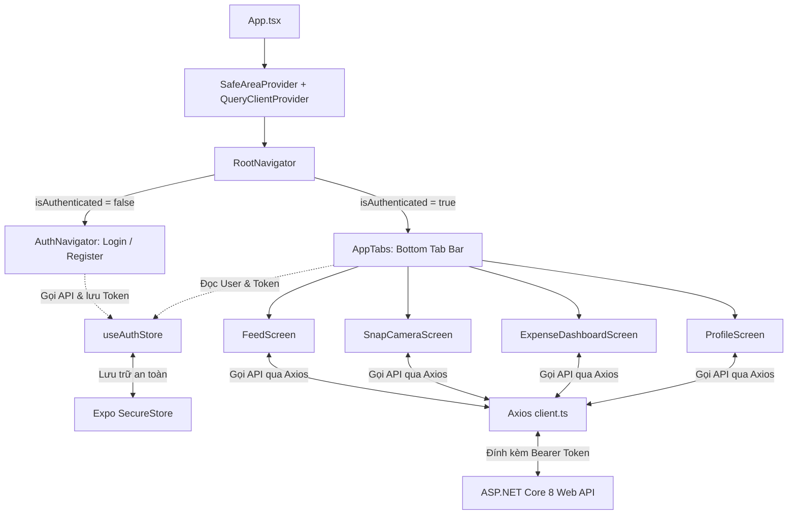

# 📸 SnapLife Mobile — Tài liệu Kiến trúc & Hướng dẫn Phát triển

> **SnapLife Mobile** là ứng dụng di động mạng xã hội chia sẻ khoảnh khắc hàng ngày (Snap) kết hợp quản lý chi tiêu cá nhân (Expense Tracking) thông minh, được xây dựng trên nền tảng **React Native (Expo SDK 52 / React Native 0.76+)** và kết nối trực tiếp với hệ thống backend **ASP.NET Core 8 Web API**.

---

## 📑 Mục lục
1. [Tổng quan công nghệ (Tech Stack)](#1-tổng-quan-công-nghệ-tech-stack)
2. [Cấu trúc thư mục dự án (Project Structure)](#2-cấu-trúc-thư-mục-dự-án-project-structure)
3. [Luồng kiến trúc & Quản lý State (Architecture & State Flow)](#3-luồng-kiến-trúc--quản-lý-state-architecture--state-flow)
4. [Các giải pháp kỹ thuật cốt lõi (Core Implementations)](#4-các-giải-pháp-kỹ-thuật-cốt-lõi-core-implementations)
5. [Cấu hình môi trường & Kết nối Backend (Networking Setup)](#5-cấu-hình-môi-trường--kết-nối-backend-networking-setup)
6. [Hướng dẫn cài đặt & Khởi chạy (Getting Started)](#6-hướng-dẫn-cài-đặt--khởi-chạy-getting-started)
7. [Quy tắc phát triển & Quy trình Git (Development & Git Rules)](#7-quy-tắc-phát-triển--quy-trình-git-development--git-rules)
8. [Định hướng & Lộ trình phát triển tương lai (Roadmap)](#8-định-hướng--lộ-trình-phát-triển-tương-lai-roadmap)

---

## 1. Tổng quan công nghệ (Tech Stack)

| Thành phần | Công nghệ / Thư viện | Phiên bản | Mục đích sử dụng |
| :--- | :--- | :--- | :--- |
| **Framework** | Expo (Managed Workflow) | SDK 52 (~57.0.22) | Môi trường phát triển ứng dụng di động đa nền tảng |
| **Core** | React Native / React | 0.86.3 / 19.2.3 | Nền tảng native engine & React core |
| **Ngôn ngữ** | TypeScript | ~6.0.3 | Định kiểu tĩnh toàn diện, kiểm soát lỗi lúc biên dịch |
| **Điều hướng** | React Navigation | v7 (Native Stack + Bottom Tabs) | Định tuyến màn hình, quản lý stack và tab bar |
| **State Management**| Zustand | ^5.0.15 | Quản lý state toàn cục (Auth, Expense, Posts) nhẹ & nhanh |
| **HTTP Client** | Axios | ^1.20.0 | Gửi request HTTP, quản lý Interceptors, tự động đính kèm JWT |
| **Data Fetching** | TanStack React Query | ^5.102.8 | Cache dữ liệu server, đồng bộ state bất đồng bộ |
| **Bảo mật** | Expo SecureStore | ~57.0.4 | Mã hóa & lưu trữ JWT Token an toàn trong Keychain / Keystore |
| **Hình ảnh & Máy ảnh**| Expo Image / ImagePicker | ~57.0.5 / ~57.0.17 | Hiển thị ảnh hiệu năng cao với cache và chụp/chọn ảnh từ thư viện |
| **Icon System** | Lucide React Native | ^1.44.0 | Hệ thống icon SVG hiện đại, đồng bộ phong cách tối giản |

---

## 2. Cấu trúc thư mục dự án (Project Structure)

```
SnapLife-Mobile/
├── assets/                  # Tài nguyên tĩnh (icon app, splash screen, logo, adaptive-icon)
├── src/
│   ├── api/                 # Tầng giao tiếp HTTP với backend API
│   │   ├── client.ts        # Cấu hình Axios instance + Interceptor đính kèm Bearer Token
│   │   ├── authApi.ts       # Các API xác thực: Login, Register, Profile, Refresh
│   │   ├── postApi.ts       # Các API bài đăng: Feed, User Posts, Reaction, Comments
│   │   ├── expenseApi.ts    # Các API chi tiêu: Dashboard, Categories, Thống kê tháng
│   │   └── mediaApi.ts      # API upload hình ảnh Multipart Form-Data
│   │
│   ├── components/          # Tái sử dụng các UI components
│   │   ├── common/          # Component dùng chung trên toàn app
│   │   │   ├── Button.tsx   # Nút bấm tùy biến (primary, secondary, outline, loading)
│   │   │   ├── Input.tsx    # Ô nhập dữ liệu chuẩn form, hỗ trợ icon và báo lỗi
│   │   │   └── Header.tsx   # Thanh tiêu đề chuẩn hóa cho các màn hình
│   │   └── feed/
│   │       └── PostCard.tsx # Thẻ bài viết trên Bảng tin: Avatar, Ảnh 1:1, Reaction, Chi tiêu
│   │
│   ├── constants/           # Các hằng số cấu hình hệ thống
│   │   ├── colors.ts        # Bảng màu chủ đạo (Dark Theme, Primary Gold #FFC837, Surface, v.v.)
│   │   └── config.ts        # Cấu hình API endpoint, tự phát hiện IP LAN từ expo-constants
│   │
│   ├── navigation/          # Cấu hình kiến trúc điều hướng ứng dụng
│   │   ├── RootNavigator.tsx   # Navigator gốc: Kiểm tra trạng thái Auth (AppTabs hoặc AuthStack)
│   │   ├── AuthNavigator.tsx   # Stack xác thực: Login, Register
│   │   └── AppTabs.tsx         # Bottom Tab Bar (Bảng tin, Snap, Chi tiêu, Cá nhân) với Active Indicator
│   │
│   ├── screens/             # Các màn hình chức năng chính
│   │   ├── auth/
│   │   │   ├── LoginScreen.tsx      # Màn hình đăng nhập tài khoản
│   │   │   └── RegisterScreen.tsx   # Màn hình đăng ký tài khoản mới
│   │   ├── feed/
│   │   │   └── FeedScreen.tsx       # Bảng tin hiển thị khoảnh khắc bạn bè
│   │   ├── camera/
│   │   │   └── SnapCameraScreen.tsx # Chụp/chọn ảnh Snap, nhập chú thích & gắn chi tiêu
│   │   ├── expense/
│   │   │   └── ExpenseDashboardScreen.tsx # Dashboard chi tiêu: Tổng tiền, biểu đồ danh mục
│   │   └── profile/
│   │       └── ProfileScreen.tsx    # Trang cá nhân: Thông tin user, Bộ sưu tập lưới 3x3 phân trang
│   │
│   ├── stores/              # Quản lý Global State với Zustand
│   │   ├── useAuthStore.ts    # State đăng nhập, thông tin User, Token, Đăng xuất
│   │   └── useExpenseStore.ts # State danh mục chi tiêu, tổng chi tiêu hàng tháng
│   │
│   ├── types/               # TypeScript Type Definitions khớp chuẩn Backend
│   │   ├── auth.types.ts      # Models Login, Register, AuthResponse
│   │   ├── user.types.ts      # User profile, Claims, Roles
│   │   ├── post.types.ts      # PostDetailVModel, PostCreateModel, ReactionType enum
│   │   ├── expense.types.ts   # ExpenseCategory, ExpenseStatistics, MonthlySummary
│   │   └── common.types.ts    # ResponseResult, PaginationModel<T>
│   │
│   └── utils/               # Các hàm tiện ích hỗ trợ
│       └── formatters.ts      # Format tiền tệ (VND), định dạng ngày tương đối, chuẩn hóa URL ảnh
│
├── App.tsx                  # Component gốc, bọc SafeAreaProvider & React Query Provider
├── app.json                 # Cấu hình Expo project metadata, quyền camera, splash
├── package.json             # Danh sách dependencies và npm scripts
└── tsconfig.json            # Cấu hình TypeScript compiler
```

---

## 3. Luồng kiến trúc & Quản lý State (Architecture & State Flow)



### Luồng xác thực (Authentication Lifecycle):
1. Khi app khởi động, `RootNavigator` gọi `restoreSession()` từ `useAuthStore`.
2. Token và User Info được đọc từ `Expo.SecureStore`:
   - Nếu token còn hạn: Tự động cập nhật `isAuthenticated = true`, người dùng vào thẳng `AppTabs`.
   - Nếu chưa có token hoặc token hết hạn: Chuyển hướng sang `AuthNavigator` (màn hình Login).
3. Khi đăng xuất (`logout()`), store xóa sạch token khỏi SecureStore, reset state về ban đầu và điều hướng tức thì về Login.

---

## 4. Các giải pháp kỹ thuật cốt lõi (Core Implementations)

### 4.1. Tự động phát hiện IP LAN của máy tính phát triển (`config.ts`)
- **Vấn đề phổ biến**: Khi test ứng dụng trên điện thoại thật bằng Expo Go, `localhost` trỏ về chính điện thoại chứ không trỏ về máy tính chạy Backend, dẫn đến lỗi mất kết nối.
- **Giải pháp**: Tận dụng thuộc tính `Constants.expoConfig?.hostUri` do Expo tự động sinh dựa trên kết nối Wi-Fi giữa điện thoại và máy tính để tự trích xuất địa chỉ IP nội bộ:
  ```typescript
  const getDevHost = (): string => {
    if (Platform.OS === 'web') return 'http://localhost:5000';
    const hostUri = Constants.expoConfig?.hostUri;
    if (hostUri) {
      const ip = hostUri.split(':')[0];
      return `http://${ip}:5000`;
    }
    return Platform.OS === 'android' ? 'http://10.0.2.2:5000' : 'http://192.168.1.68:5000';
  };
  ```

### 4.2. Bố cục lưới Bộ sưu tập 3x3 chống tràn Subpixel (`ProfileScreen.tsx`)
- **Vấn đề**: Các dòng điện thoại màn hình siêu nét (như Xiaomi Poco X7 Pro, Samsung S24 Ultra, iPhone Pro Max) có tỷ lệ subpixel lẻ. Nếu dùng `flexWrap: 'wrap'` kết hợp tính pixel thủ công, chỉ cần lệch 0.1 pixel do viền border thì ảnh thứ 3 sẽ bị đẩy xuống dòng, khiến mỗi hàng chỉ còn 2 ảnh.
- **Giải pháp**: Áp dụng thuật toán **Flexbox Row Chunking**:
  - Chia mảng bài đăng `myPosts` thành từng nhóm con (mỗi nhóm đúng 3 ảnh):
    ```typescript
    const rows: PostDetailVModel[][] = [];
    for (let i = 0; i < myPosts.length; i += 3) {
      rows.push(myPosts.slice(i, i + 3));
    }
    ```
  - Mỗi nhóm là một dòng `flexDirection: 'row'` chứa 3 item `{ flex: 1, aspectRatio: 1 }`.
  - Flexbox tự động chia đều chiều ngang thành 3 cột vuông vức 1:1, **triệt tiêu 100% khả năng rớt dòng**.
  - Nếu hàng cuối thiếu ảnh, tự động thêm các component `gridSpacer` (`flex: 1`) để giữ căn lề chuẩn bên trái.

### 4.3. Nổi bật Tab đang chọn (Dynamic Active Focus Tab) (`AppTabs.tsx`)
- Tab bar phía dưới được thiết kế chuẩn UX hiện đại: Tab đang được người dùng chọn sẽ hiển thị một khối bo tròn màu vàng đặc trưng (`#FFC837`) bao quanh icon với icon màu đen, trong khi các tab chưa chọn hiển thị icon màu xám tối giản.

### 4.4. Tối ưu Responsive đa màn hình (Foldable, Tablet, Landscape, Web)
- Khung ảnh Snap sử dụng CSS `aspectRatio: 1` để luôn vuông vắn trên mọi kích cỡ.
- Tất cả màn hình đều áp dụng `maxWidth: 540` (hoặc `maxWidth: 460` cho Auth) kết hợp `alignSelf: 'center'` để giao diện không bị kéo dãn trên iPad, Tablet hay trình duyệt Web.

---

## 5. Cấu hình môi trường & Kết nối Backend (Networking Setup)

Backend chạy ASP.NET Core 8 Web API tại cổng `http://localhost:5000` (hoặc `https://localhost:5001`).

1. **Khởi động Backend WebApi**:
   ```powershell
   cd d:\Github\SnapLife\SL.WebApi
   dotnet run --launch-profile http
   ```
   > Đảm bảo Swagger phản hồi tại: `http://localhost:5000/swagger/index.html`.

2. **Cấu hình Firewall Windows (Nếu test điện thoại qua Wi-Fi)**:
   - Điện thoại và máy tính cần kết nối cùng một mạng Wi-Fi (hoặc phát Hotspot).
   - Đảm bảo Windows Defender Firewall cho phép kết nối inbound tới cổng 5000.

---

## 6. Hướng dẫn cài đặt & Khởi chạy (Getting Started)

### Yêu cầu hệ thống
- **Node.js**: Phiên bản 18.x trở lên (khuyên dùng Node 20 LTS).
- **npm** hoặc **yarn**.
- Ứng dụng **Expo Go** đã cài đặt trên điện thoại (tải từ Google Play Store hoặc App Store).

### Các bước khởi chạy
1. **Cài đặt các gói thư viện**:
   ```bash
   cd d:\Github\SnapLife-Mobile
   npm install
   ```

2. **Kiểm tra biên dịch kiểu TypeScript (Không phát sinh lỗi)**:
   ```bash
   npx tsc --noEmit
   ```

3. **Khởi chạy máy chủ Metro Bundler**:
   ```bash
   npx expo start
   ```

4. **Trải nghiệm ứng dụng**:
   - **Trên điện thoại Android**: Mở app **Expo Go**, chọn *Scan QR code* và quét mã QR trên terminal.
   - **Trên điện thoại iOS**: Mở ứng dụng **Camera**, quét mã QR để mở trong Expo Go.
   - **Trên trình duyệt Web**: Bấm phím `w` trong terminal.
   - **Reload lại code**: Bấm phím `r` trong terminal.

---

## 7. Quy tắc phát triển & Quy trình Git (Development & Git Rules)

> ⚠️ **QUY TẮC BẮT BUỘC**: Tuyệt đối **KHÔNG** sửa đổi hoặc commit trực tiếp trên nhánh `main`.

Mọi tính năng mới hoặc sửa lỗi đều phải tuân thủ nghiêm ngặt quy trình sau:

```bash
# 1. Tạo và chuyển sang nhánh mới cho tính năng hoặc lỗi cần fix
git checkout -b feature/ten-tinh-nang   # hoặc fix/ten-loi-can-sua

# 2. Thực hiện sửa đổi và kiểm tra cú pháp TypeScript
npx tsc --noEmit

# 3. Commit code trên nhánh tính năng
git add .
git commit -m "feat(module): mô tả ngắn gọn thay đổi"

# 4. Chuyển về nhánh main và merge code từ nhánh tính năng
git checkout main
git merge feature/ten-tinh-nang

# 5. Đẩy code lên GitHub repository
git push origin main

# 6. Xóa nhánh tính năng cục bộ sau khi đã merge thành công
git branch -d feature/ten-tinh-nang
```

### Chuẩn đặt tên:
- **Tên Component / Màn hình**: PascalCase (`PostCard.tsx`, `ProfileScreen.tsx`).
- **Tên Hook / Store**: camelCase với tiền tố `use` (`useAuthStore.ts`, `useExpenseStore.ts`).
- **Tên Types / Interfaces**: PascalCase (`PostDetailVModel`, `ExpenseItemModel`).

---

## 8. Định hướng & Lộ trình phát triển tương lai (Roadmap)

- [ ] **Tích hợp AI OCR nhận diện hóa đơn**: Sử dụng Gemini API đọc thông tin hóa đơn từ ảnh chụp trong Snap để tự động điền số tiền và danh mục chi tiêu.
- [ ] **Xác thực sinh trắc học**: Tích hợp `expo-local-authentication` cho phép mở khóa bằng FaceID / Vân tay.
- [ ] **Thông báo đẩy (Push Notifications)**: Sử dụng `expo-notifications` thông báo tức thì khi có bạn bè thả cảm xúc hoặc bình luận vào Snap.
- [ ] **Báo cáo tài chính chuyên sâu**: Vẽ biểu đồ tròn/cột phân tích dòng tiền theo tuần/tháng với `react-native-svg` / `victory-native`.
- [ ] **Hỗ trợ chế độ Offline**: Sử dụng SQLite hoặc WatermelonDB để lưu trữ đệm dữ liệu khi mất mạng và tự động đồng bộ khi có kết nối trở lại.
- [ ] **Đa ngôn ngữ (i18n)**: Hỗ trợ chuyển đổi mượt mà giữa Tiếng Việt và Tiếng Anh.

---

*Tài liệu được khởi tạo và cập nhật cho dự án SnapLife Mobile.*
